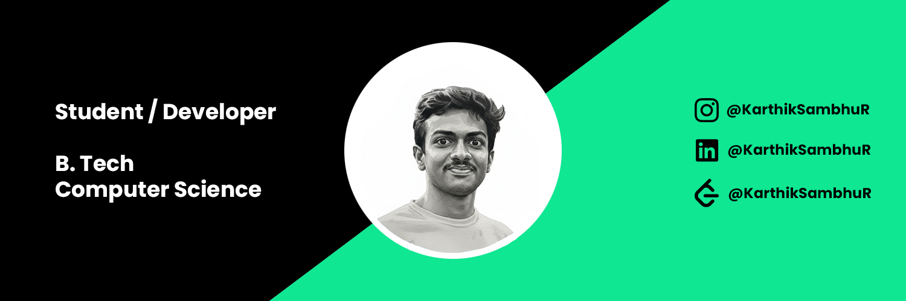

# 
Hi there, I'm Karthik Sambhu R! 👋

  

  <a href="https://karthiksambhur.pages.dev"><b>Portfolio</b></a> •
  <a href="https://linkedin.com/in/karthiksambhur"><b>LinkedIn</b></a> •
  <a href="https://twitter.com/karthiksambhur"><b>Twitter</b></a>

---

### 💫 About Me
I'm a passionate developer specializing in building scalable backend systems, interactive frontends, and exploring the world of embedded systems. I love bridging the gap between hardware and software.

---

### 🚀 Technologies & Tools

#### 💻 Backend & Languages

  

<i>Includes: Java, Python, Node.js, C (Embedded), Go, Rust, Flask, Django, Spring, Arduino, Cloudflare (Workers, D1, R2), Firebase</i>

#### 🌐 Frontend Development

  

<i>Includes: HTML5, CSS3, JavaScript, Flutter, Android, Next.js, React, Tailwind CSS</i>

#### 🛠️ Tools & DevOps

  

<i>Includes: Git, GitHub, Docker, Figma, Photoshop, Tauri, Electron</i>

---

### 📊 GitHub Stats

  

---

  

